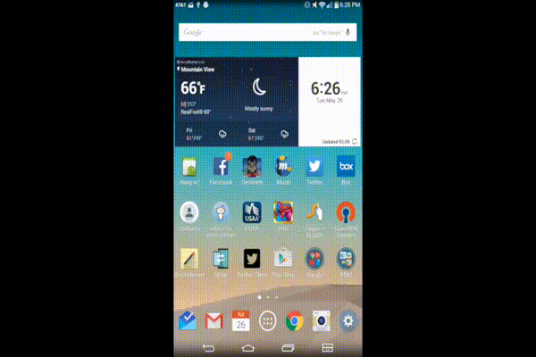

# Project 3 - twitter-client

twitter-client is an android app that allows a user to view his Twitter timeline and post a new tweet. The app utilizes [Twitter REST API](https://dev.twitter.com/rest/public).

Time spent: **30** hours spent in total

## User Stories

The following **required** functionality is completed:

* [X]	User can **sign in to Twitter** using OAuth login
* [X]	User can **view tweets from their home timeline**
  * [X] User is displayed the username, name, and body for each tweet
  * [X] User is displayed the [relative timestamp](https://gist.github.com/nesquena/f786232f5ef72f6e10a7) for each tweet "8m", "7h"
  * [X] User can view more tweets as they scroll with [infinite pagination](http://guides.codepath.com/android/Endless-Scrolling-with-AdapterViews). Number of tweets is unlimited.
    However there are [Twitter Api Rate Limits](https://dev.twitter.com/rest/public/rate-limiting) in place.
* [X] User can **compose and post a new tweet**
  * [X] User can click a “Compose” icon in the Action Bar on the top right
  * [X] User can then enter a new tweet and post this to twitter
  * [X] User is taken back to home timeline with **new tweet visible** in timeline

The following **optional** features are implemented:

* [X] User can **see a counter with total number of characters left for tweet** on compose tweet page
* [X] User can **click a link within a tweet body** on tweet details view. The click will launch the web browser with relevant page opened.
* [X] User can **pull down to refresh tweets timeline**
* [X] User can **open the twitter app offline and see last loaded tweets**. Persisted in SQLite tweets are refreshed on every application launch. While "live data" is displayed when app can get it from Twitter API, it is also saved for use in offline mode.
* [X] User can tap a tweet to **open a detailed tweet view**
* [X] User can **select "reply" from detail view to respond to a tweet**
* [X] Improve the user interface and theme the app to feel "twitter branded"

The following **bonus** features are implemented:

* [X] User can see embedded image media within the tweet detail view
* [X] Compose tweet functionality is build using modal overlay

The following **additional** features are implemented:

* [X] User can click on the Camera icon to add an image and the location icon to add their current location to the tweet.
* [X] Progress bars are handled using an animated twitter flying bird.

## Video Walkthrough 

Here's a walkthrough of implemented user stories:

[Higher Resolution Youtube Video](https://youtu.be/4gW0nqUaLLQ)

GIF created with [gifsicle](https://gist.github.com/dergachev/4627207).

## Notes
To come:  Tabs/Mentions switch with tabs
* View Profile
* View Others Profile
* Search
* Direct Messages

Accidently posted my api/consumer secret.  The ones in this github have been deactivated and will no longer work.

## Open-source libraries used

- [Android Async HTTP](https://github.com/loopj/android-async-http) - Simple asynchronous HTTP requests with JSON parsing
- [Picasso](http://square.github.io/picasso/) - Image loading and caching library for Android

## License

    Copyright [2015] [Matthew Jones]

    Licensed under the Apache License, Version 2.0 (the "License");
    you may not use this file except in compliance with the License.
    You may obtain a copy of the License at

        http://www.apache.org/licenses/LICENSE-2.0

    Unless required by applicable law or agreed to in writing, software
    distributed under the License is distributed on an "AS IS" BASIS,
    WITHOUT WARRANTIES OR CONDITIONS OF ANY KIND, either express or implied.
    See the License for the specific language governing permissions and
    limitations under the License.
